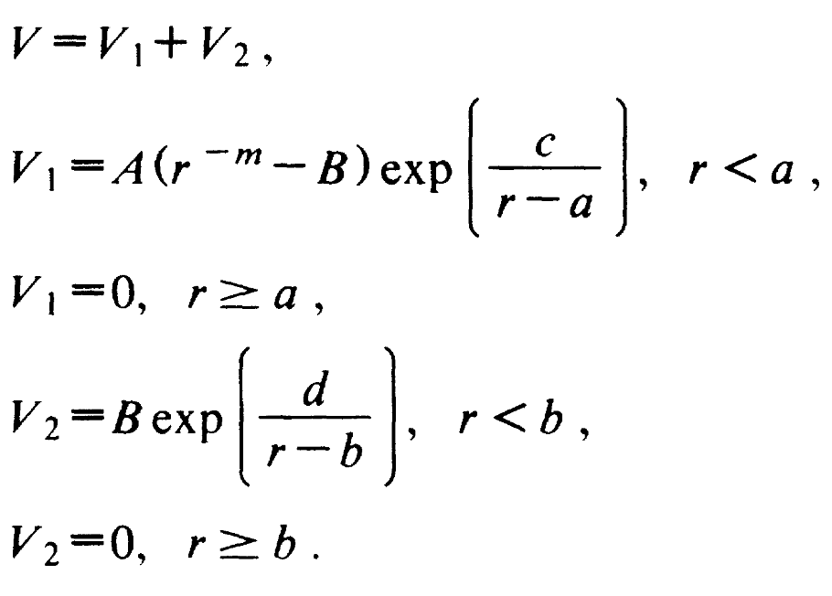
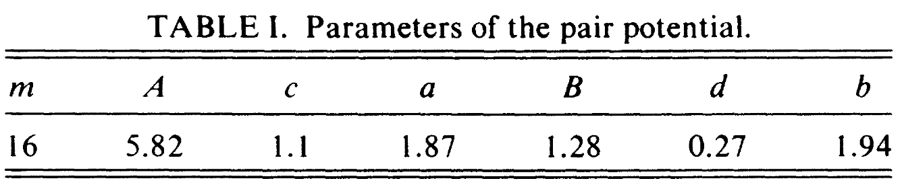

Author information

-----------------------------------------------

Yuan-Chao Hu (ychu0213@gmail.com)

SSLAB

--------------------------------------------------------

This module provide LJ type Dzugutov potential for MD simulations. This potential is to model a single-component glass-former which favors local icosaheral ordering.
The form of the potential is :

The parameters have the following values:

The usage from lammps is as following"

----

pair_style       dzugutov 1.94

pair coeff       1 1 1.94

----

The last number for each line is the cutoff distance.
The other parameters are included in the module itself.

Benchmarking of analytical function to lammps simulations:

