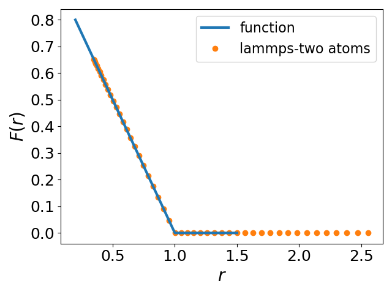

Author information

-----------------------------------------------

Yuan-Chao Hu (ychu0213@gmail.com)

The University of Tokyo

--------------------------------------------------------

This module provide a new pairwise potential for MD simulations,
the form of the potential is :

$$
V(r) = \frac{\epsilon}{\alpha} \left(1 - \frac{r}{\sigma} \right) ^ \alpha
$$
which is Harmonic if $\alpha$ = 2, Hertzian if $\alpha$ = 5/2.

In this module, $\alpha$ is specific for each atom type $i-i$. For $i-j$ mixing,
$\alpha$ value of $i-i$ will be taken if not specified. Therefore, mixing different interactions
is possible for a system with multiple atomic types. **However**, setting all the parameters for each pair explicitly is more preferred.

The usage from lammps is as following"

----

pair_style       lj/powerlaw  1.0

pair_coeff       1 1 1.0 1.0  2.0  1.0

pair_coeff       1 2 1.0 0.95  2.0  0.95

pair_coeff       2 2 1.0 0.90 2.0 0.90

----

The last number for each line is the cutoff distance.
for pair_coeff, the other numbers represent
"type 	type	 $\epsilon$  	  $\sigma$ 	  $\alpha$"

Benchmarking of analytical function to lammps simulations:

