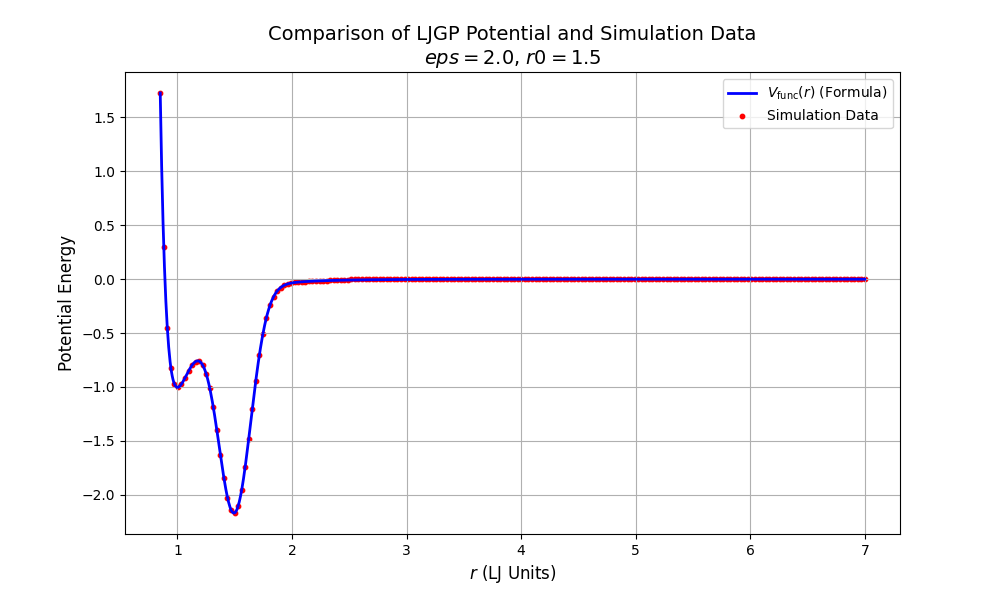

### Author information

Ting Lei (<leitingleonard@gmail.com>)

Institute of Mechanics, Chinese Academy of Sciences

Songshan Lake Materials Laboratory

----

### LJGP Potential

#### Description

This module provide a new pairwise potential for MD simulations

The **LennardJones Gauss potential (LJGP)** is constructed by adding a negative Gaussian to the LennardJones pair potential

$$
V_{LJGP}(r)=\frac{1}{r^{12}}-\frac{1}{r^6}-\varepsilon \exp(-\frac{(r-r_0)^2}{2\sigma_G^2})
$$

where we fixed the width of the Gaussian to $\sigma_G^2=0.02$  (and $\sigma_{LJ}$ in the  Lennard-Jones potential is set to $2^{-1/6}$ and $\varepsilon_{LJ}=1$). The two remaining parameters are the position $r_0$ and depth $\varepsilon$ of the Gaussian. Because the potential converges rapidly, we truncated it at $r=2.5$.

----

#### Examples

```bash
    pair_style      lj/gp 2.5               # cut_global = 2.5
    pair_coeff      1 1 2.0 1.5             # eps=2.0, r0=1.5
```

----

#### Accuracy



----

### LJ/GP/Smooth/Linear Potential

#### Description

Style lj/gp/smooth/linear computes a truncated and force-shifted lj/gp interaction (aka Shifted Force lj/gp) that combines the standard lj/gp function and subtracts a linear term based on the cutoff distance, so that both, the potential and the force, go continuously to zero at the cutoff $r_c$

$$
V_{LJGP}(r)=\frac{1}{r^{12}}-\frac{1}{r^6}-\varepsilon \exp(-\frac{(r-r_0)^2}{2\sigma_G^2})
$$

$$
E(r) = V(r) - V(r_c) - (r - r_c) \left. \frac{dV}{dr} \right|_{r = r_c}
$$

----

#### Examples

```bash
    pair_style      lj/gp/smooth/linear 2.5     # cut_global = 2.5
    pair_coeff      1 1 2.0 1.5                 # eps=2.0, r0=1.5
```