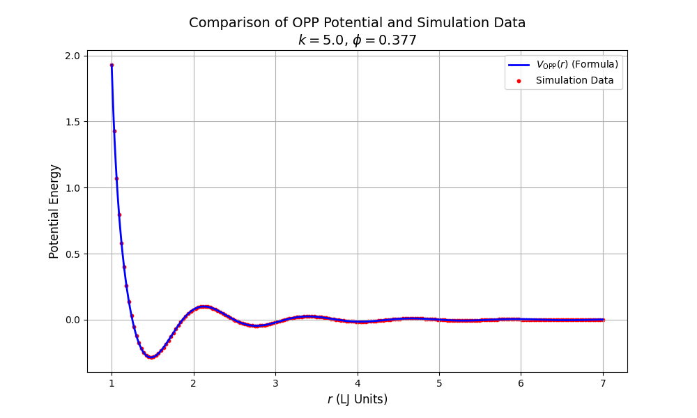
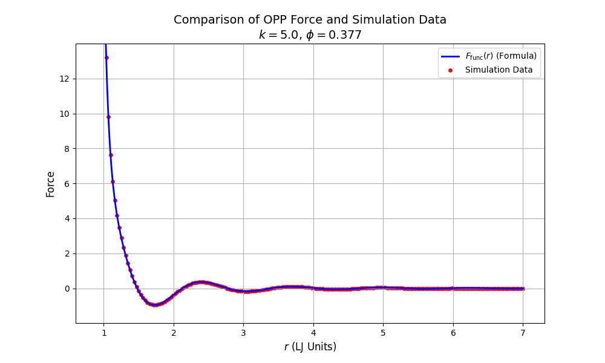
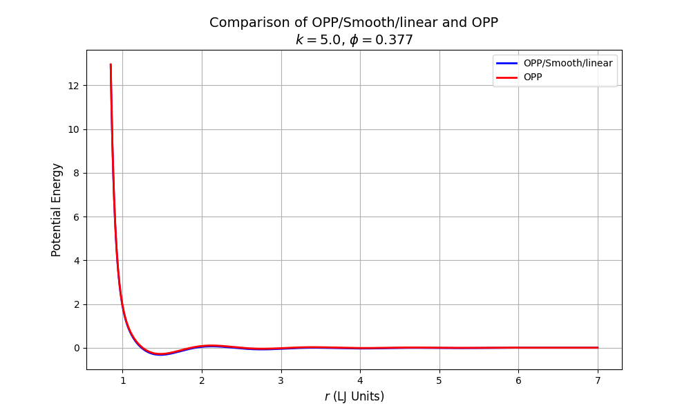
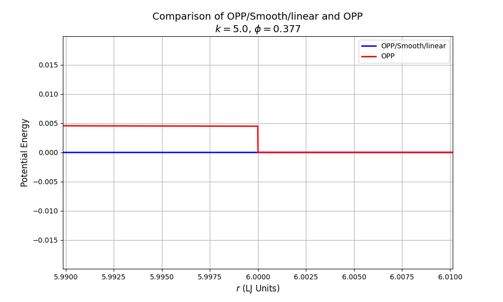
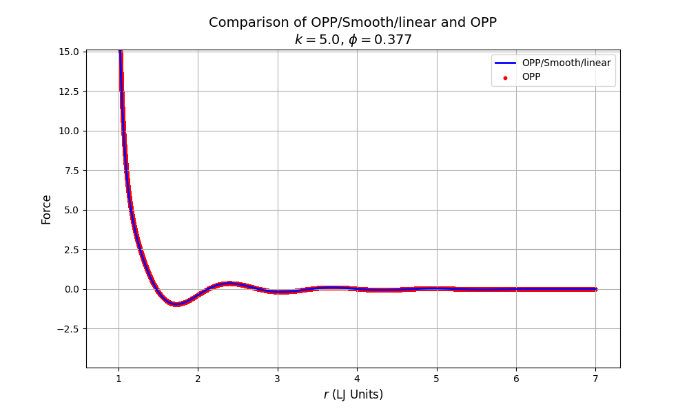
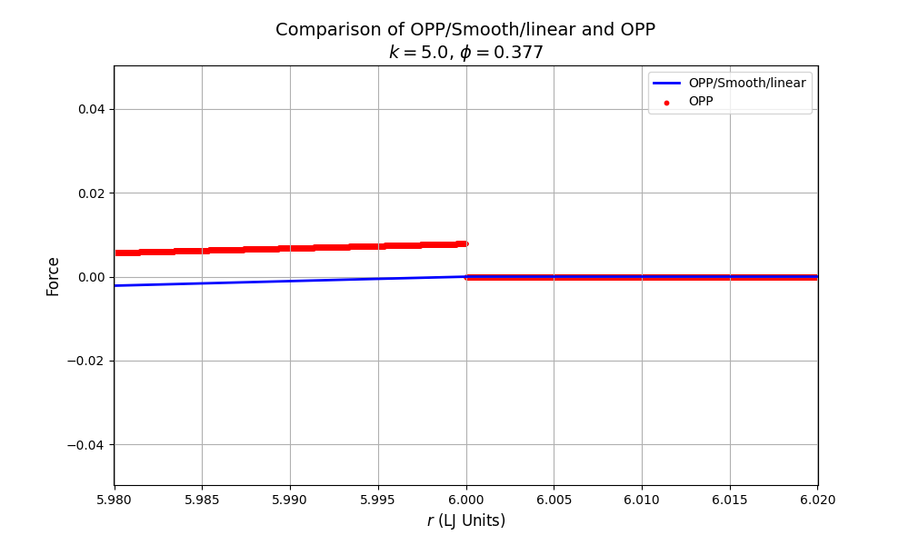

### Author information

Ting Lei (<leitingleonard@gmail.com>)

Institute of Mechanics, Chinese Academy of Sciences

Songshan Lake Materials Laboratory

----

### OPP Potential

#### Description

This module provide a new pairwise potential for MD simulations

The functional form of the **oscillating pair potential (OPP)** that we use is based on the MihalkovicˇHenley interaction potential. Its shape is closely related to the potential form used for the self-assembly of complex structures in monatomic systems. The OPP is given by

$$
V_{OPP}(r)=\frac{1}{r^{15}}+\frac{\cos(k(r-1)+\phi)}{r_3}
$$

Parameters $k$ and $\phi$ describe the wavenumber and phase shift of a damped oscillation, respectively. The oscillation is truncated and shifted to zero at the local maximum following the second attractive well. The corresponding force is given by:

$$
F_{OPP}(r)=-\frac{dV_{OPP}(r)}{dr}
$$

----

#### Examples

```bash
    pair_style      opp 6                 # cut_global = 6.0
    pair_coeff      1 1 5.0 0.377         # k=5.0, phi=0.377
```

----

#### Accuracy

|  |  |
|:-------------------------:|:-------------------------:|
|Potential|Force|

----

### OPP/Smooth/linear Potential

#### Description

Style opp/smooth/linear computes a truncated and force-shifted OPP interaction (aka Shifted Force OPP) that combines the standard OPP function and subtracts a linear term based on the cutoff distance, so that both, the potential and the force, go continuously to zero at the cutoff $r_c$

$$
V_{OPP}(r)=\frac{1}{r^{15}}+\frac{\cos(k(r-1)+\phi)}{r_3}
$$

$$
E(r) = V(r) - V(r_c) - (r - r_c) \left. \frac{dV}{dr} \right|_{r = r_c}
$$

----

#### Examples

```bash
    pair_style      opp/smooth/linear 6      # cut_global = 6.0
    pair_coeff      1 1 5.0 0.377            # k=5.0, phi=0.377
```

----

#### Accuracy

If I set the cutoff at $r=6.0$, this adjustment will help smooth the discrepancy between the OPP potential and the cutoff point, ensuring a more continuous transition of the potential function and reducing artificial discontinuities in force calculations.

##### Potential： OPP/Smooth/Linear vs. OPP

|  |  |
|:-------------------------:|:-------------------------:|
|Full-range distribution ($0.85 ≤ r ≤ 7.0$)|Cutoff region detail ($r=6.0$)|

##### Force： OPP/Smooth/Linear vs. OPP

|  |  |
|:-------------------------:|:-------------------------:|
|Full-range distribution ($0.85 ≤ r ≤ 7.0$)|Cutoff region detail ($r=6.0$)|