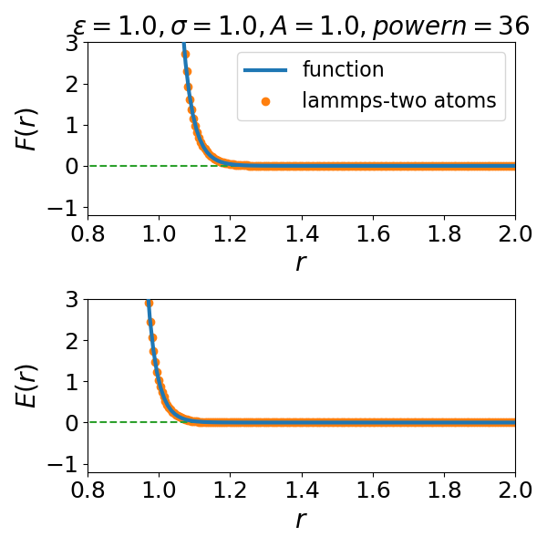
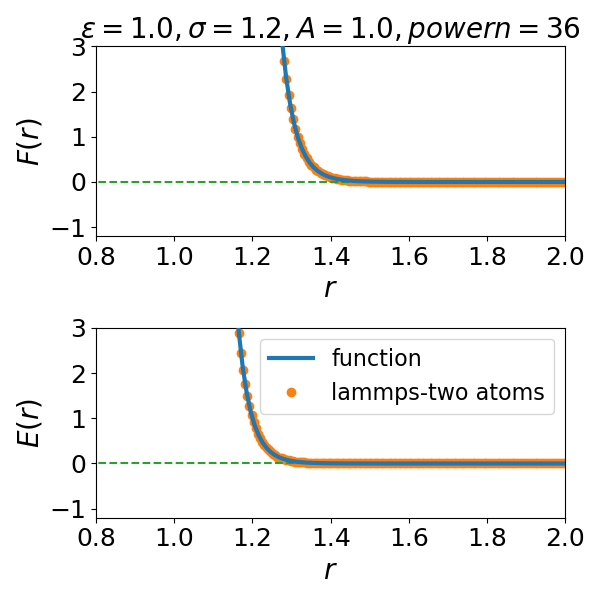
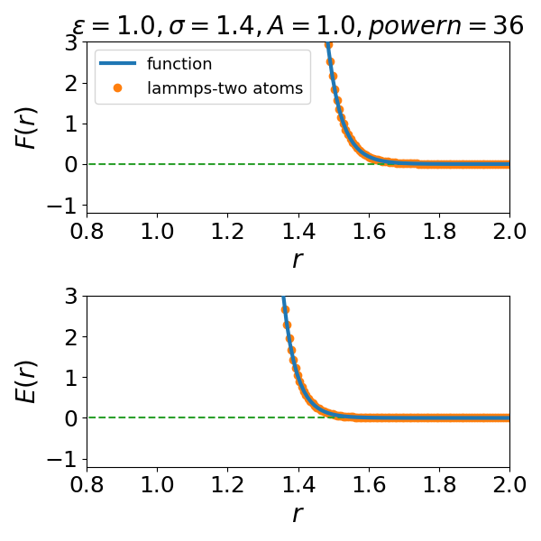
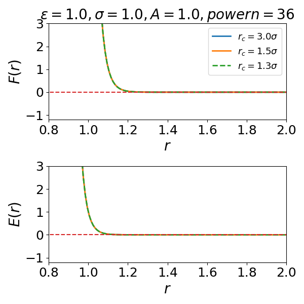
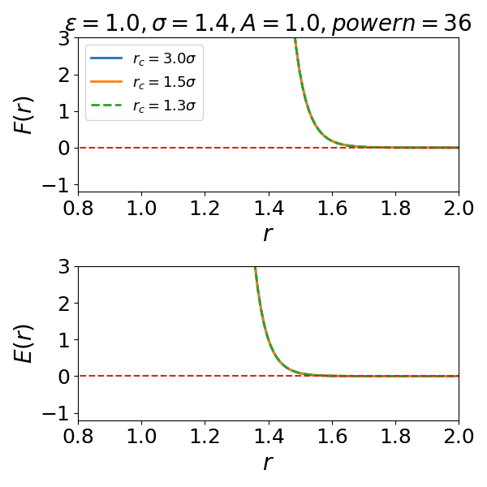
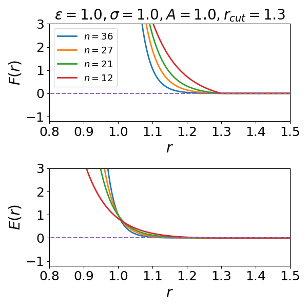

Author information

-----------------------------------------------

Yuan-Chao Hu (ychu0213@gmail.com)

The University of Tokyo

--------------------------------------------------------

This module provide a new pairwise potential for MD simulations,
the form of the potential is :
$$
V(r)=A\epsilon \left(\frac{\sigma}{r} \right)^n
$$
Both the potential and force are shifted at the cutoff $r_c$ using a linear method:
$$
E(r) = V(r) - V(r_c) - (r-r_c)\frac{dU}{dr}|_{r=r_c}
$$
In this module, $A$ and $n$ are specific for each atom type $i-i$. For $i-j$ mixing, their values of $i-i$ will be taken if not specified. **HOWEVER**, parameters for each pair should prefer be given explicitly. Therefore, mixing different interactions is possible for a system with multiple atomic types.

The usage from lammps is as following for a binary soft-core model:

----

pair_style       lj/IPL  3.0

pair_coeff       1 1 1.0 1.0 1.0 36 3.0

pair_coeff       1 2 1.0 1.2 1.0 36 3.6

pair_coeff       2 2 1.0 1.4 1.0 36 4.2

----

The last number for each line is the cutoff distance.
For pair_coeff, the other numbers represent
"type    type     $\epsilon$      $\sigma$      A      n "

Benchmarking the potential energy and force between the analytical function and two-atom simulation by lammps for the above settings is as:

There is a weak dependence of the force and energy on the cutoff distance, as long as cutoff is a little larger than where force $F(r)$ decays to 0, see below for some examples:

The influence of the exponent on the force and potential is as following:

